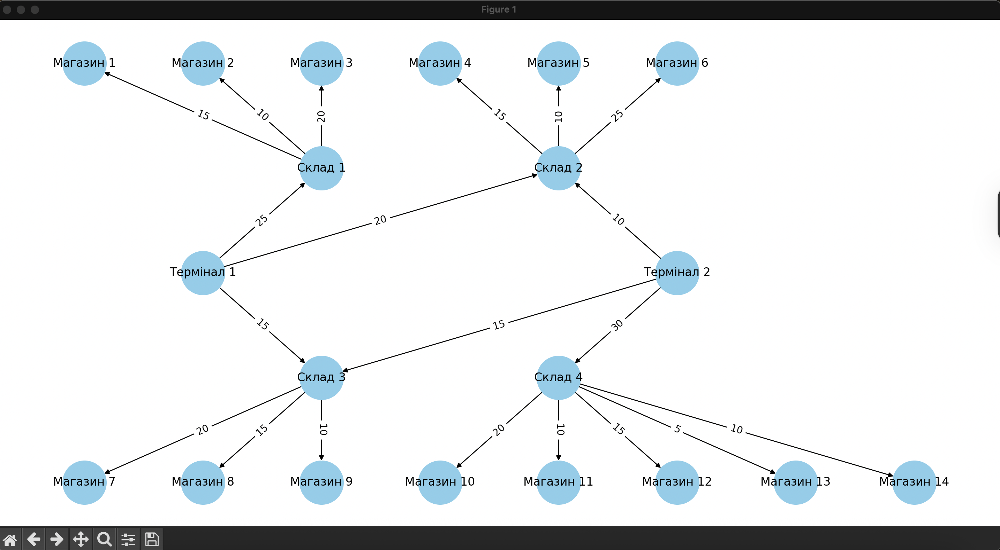
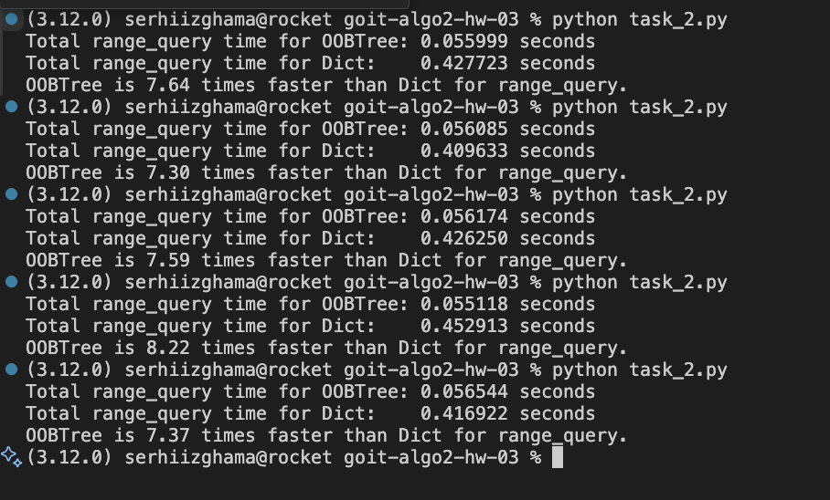

# Task 1

## Как работает алгоритм
Я применил алгоритм Эдмондса–Карпа по шагам:
1. С помощью BFS ищем любой путь от «Джерело» до «Сток» с ненулевой пропускной способностью.  
2. Находим минимальную способность (capacity) вдоль этого пути.  
3. Пропускаем такой поток: добавляем его по прямому ребру и вычитаем по обратному, чтобы сохранить баланс.  
4. Повторяем пункты 1–3, пока не останется ни одного пути с доступным ресурсом.

---

## Результаты потоков

| Термінал   | Магазин    | Фактичний Потік (од.) |
| ---------- | ---------- | --------------------- |
| Термінал 1 | Магазин 1  | 15                    |
| Термінал 1 | Магазин 2  | 10                    |
| Термінал 1 | Магазин 4  | 15                    |
| Термінал 1 | Магазин 5  | 10                    |
| Термінал 1 | Магазин 6  | 5                     |
| Термінал 1 | Магазин 7  | 15                    |
| Термінал 1 | Магазин 8  | 10                    |
| Термінал 2 | Магазин 4  | 10                    |
| Термінал 2 | Магазин 5  | 10                    |
| Термінал 2 | Магазин 6  | 5                     |
| Термінал 2 | Магазин 7  | 15                    |
| Термінал 2 | Магазин 8  | 10                    |
| Термінал 2 | Магазин 10 | 20                    |
| Термінал 2 | Магазин 11 | 10                    |

**Общий максимальный поток**: 115 единиц

---

## Ответы на вопросы

1. **Какие терминалы обеспечивают наибольший поток?**  
   - Оба терминала (Т1 и Т2) дали по **80 единиц** в сеть. Хотя у Т1 была бóльшая теоретическая способность, реальная доставка выровнялась из-за «узких» мест дальше по сети.

2. **Какие маршруты имеют наименьшую пропускную способность?**  
   - Самое слабое ребро — **Склад 4 → Магазин 13** (5 ед.).  
   - Есть ещё несколько по 10 ед. (например, Т2→Склад 2 и Склад 3→Магазин 9).  
   Эти «бутылочные горлышки» снижают общий поток.

3. **Какие магазины получили наименьшее количество товара?**  
   - **Магазины 3, 9, 12, 13, 14** вообще не получили ничего.  
   - **Магазин 6** получил всего по 5 ед. от каждого терминала (итого 10).  
   _Можно повысить их снабжение_, увеличив пропускные способности ребер к этим магазинам (склады→магазины) или каналов от терминалов к складам.

4. **Есть ли узкие места, которые стоит устранить?**  
   - **Склад 4** обслуживает сразу 5 магазинов, но получает поток только от Терминала 2.  
   - **Склад 1** из-за лимита 25 ед. от Т1 не может передать поток в Магазин 3.  
   Повышение пропускной способности этих каналов улучшит эффективность всей логистической сети.

# Task 2
В этой задаче мы разработали структуру хранения данных для больших наборов данных с использованием OOBTree и стандартного словаря. На основе анализа производительности времени выполнения запросов диапазона мы пришли к выводу, что структура OOBTree более эффективна для обработки крупномасштабных операций хранения и извлечения данных.

